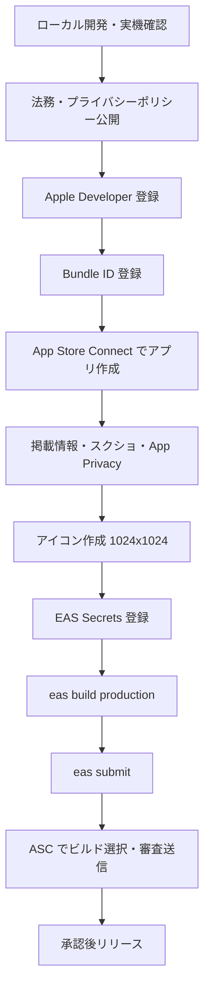

# Expo → App Store リリース手順書

Expo（React Native）アプリを App Store に公開するまでの一連の流れを形式知化したドキュメント。
初回リリース・更新リリースの両方で使える。

> **Cursor Skill:** `expo-app-store-release`（`~/.cursor/skills/expo-app-store-release/`）
> チャットで App Store 公開を依頼すると、この Skill が自動適用される。

> **公開用引き継ぎ要約:** [HANDOVER.md](./HANDOVER.md)
> 非公開の詳細引き継ぎ資料はObsidianの `04_プロジェクト/Codex/ToDo_HANDOVER_private.md` を参照。

**実績プロジェクト:** 今日だけToDo（公開識別子のみ記載）

---

## 全体フロー



---

## 前提条件

| 項目 | 内容 |
|------|------|
| Node.js | **20 LTS**（`.nvmrc` 参照。v26 は避ける） |
| アカウント | [expo.dev](https://expo.dev)、[Apple Developer Program](https://developer.apple.com/programs/)（年 $99） |
| ローカルツール | `eas-cli`（`npm install -g eas-cli`） |
| Xcode | シミュレータ・スクショ撮影用（実機ビルドは EAS で可） |

---

## Phase 0: プロジェクト初期設定

### 必須ファイル

```text
app.config.ts      # bundleIdentifier, AdMob, 暗号化申告
eas.json           # build / submit プロファイル
.env               # ローカル開発用（git に含めない）
.env.example       # テンプレート
.nvmrc             # Node 20
.npmrc             # peer 依存エラー回避など
assets/icon.svg    # 正方形アイコンのソース
assets/icon.png    # 1024x1024（App Store 用）
```

### `app.config.ts` チェック項目

- `ios.bundleIdentifier`
- `ios.infoPlist.ITSAppUsesNonExemptEncryption: false`
- AdMob プラグインに iOS/Android App ID を設定
- 公開リポジトリでは、秘密情報や個人アカウント情報を直接書かない

### `eas.json` テンプレート（submit 部分）

```json
"submit": {
  "production": {
    "ios": {
      "appleId": "YOUR_APPLE_ID@example.com",
      "appleTeamId": "XXXXXXXXXX",
      "ascAppId": "1234567890"
    }
  }
}
```

> **注意:** `ascAppId` に `0000000000` などのプレースホルダーを入れると提出が失敗する。
> 初回は `ascAppId` を省略して対話モードで自動解決させてもよい。成功後に実 ID を書き込む。

---

## Phase 1: ローカル開発

```bash
cd /path/to/project
nvm use
npm install
cp .env.example .env
npm run start:dev
npx expo run:ios
```

### スクリーンショット撮影

```bash
npm run screenshots
```

| 順番 | 画面 |
|------|------|
| 1 | タスク複数件のメイン画面 |
| 2 | 空状態 |
| 3 | 1件完了 |
| 4 | 全完了 |
| 5 | 設定画面 |

---

## Phase 2: 法務・プライバシーポリシー

### ファイル

- `legal/privacy-policy.html` — 原本
- `docs/privacy-policy.html` — GitHub Pages 公開用
- `app/privacy-policy.tsx` — アプリ内表示
- `legal/app-store-listing.md` — 説明文・キーワード文案

### GitHub Pages 公開手順

1. GitHub に push
2. リポジトリ **Settings → Pages**
3. Branch: `main` / フォルダ: `/docs`
4. 公開 URL を `.env` と `app.config.ts` に設定

```text
EXPO_PUBLIC_PRIVACY_POLICY_URL=https://YOUR_USER.github.io/REPO/privacy-policy.html
```

### ログインなしアプリの記載ポイント

- タスクデータは端末内のみ（サーバー送信なし）
- AdMob 利用・広告識別子の収集あり
- 13歳未満向けではない

---

## Phase 3: Apple Developer

### 3-1. Bundle ID 登録

[developer.apple.com/account](https://developer.apple.com/account/) → **Identifiers** → **+**

| 項目 | 値 |
|------|-----|
| Type | App |
| Bundle ID | Explicit ID |
| Capabilities | 基本は不要（AdMob は SDK 側で足りる） |

### 3-2. EAS ログイン・プロジェクト紐づけ

```bash
eas login
eas init
```

---

## Phase 4: App Store Connect — アプリ作成

[appstoreconnect.apple.com](https://appstoreconnect.apple.com/) → **マイ App** → **＋**

| 項目 | 例 |
|------|-----|
| プラットフォーム | iOS |
| 名前 | アプリ名 |
| プライマリ言語 | 日本語 |
| Bundle ID | 登録済みBundle ID |
| SKU | 任意の英数字 |

### App 情報

| 項目 | 設定 |
|------|------|
| プライマリカテゴリ | 仕事効率化など |
| セカンダリカテゴリ | 任意 |
| プライバシーポリシー URL | GitHub Pages の URL |
| 年齢制限 | 質問に回答 |
| コンテンツの配信権 | 第三者コンテンツがなければ「いいえ」 |

### App のプライバシー（AdMob ありの場合）

**データを収集しますか？** → **はい**

| データ種別 | 目的 | ユーザーに紐づく | トラッキング |
|-----------|------|----------------|-------------|
| デバイス ID | サードパーティ広告 | いいえ | はい |
| 広告データ | サードパーティ広告 | いいえ | はい |

---

## Phase 5: アイコン作成

### 要件

- **1024×1024 px、正方形、PNG**
- 角丸は iOS が自動適用するので、画像自体は直角の正方形で OK
- 横長画像を正方形に引き伸ばさない

### 推奨ワークフロー

```bash
npm run icons:generate
sips -g pixelWidth -g pixelHeight assets/icon.png
```

アイコン変更後は必ず再ビルド + 再提出が必要。

---

## Phase 6: EAS Secrets / 環境変数

```bash
eas secret:create --scope project --name EXPO_PUBLIC_USE_TEST_ADS --value false
eas secret:create --scope project --name EXPO_PUBLIC_ADMOB_IOS_APP_ID --value "ca-app-pub-xxx~xxx"
eas secret:create --scope project --name EXPO_PUBLIC_ADMOB_BANNER_IOS --value "ca-app-pub-xxx/xxx"
eas secret:create --scope project --name EXPO_PUBLIC_PRIVACY_POLICY_URL --value "https://..."
eas secret:create --scope project --name EXPO_PUBLIC_CONTACT_EMAIL --value "your@email.com"
```

`eas.json` の production プロファイルでも `EXPO_PUBLIC_USE_TEST_ADS: "false"` を設定する。

---

## Phase 7: ビルド & 提出

```bash
eas build --profile production --platform ios
eas submit --profile production --platform ios
```

提出後 5〜30 分でビルドが App Store Connect に表示される。

---

## Phase 8: 審査送信 & 配信設定

| 項目 | 設定 |
|------|------|
| ビルド | 最新ビルドを選択 |
| 連絡先 | 審査担当者の連絡先 |
| サインイン情報 | ログイン不要アプリならチェックを外す |
| 配信方法 | 手動または自動 |
| 価格 | 無料など |

### 審査用メモ例

```text
This app does not require login or account registration.
All features are available immediately after launch.
Tasks are stored locally on the device only.
Banner ads are displayed at the bottom via Google AdMob.
```

---

## 公開済みアプリの更新リリース

今日だけToDoはすでにApp Store公開済みのため、今後は「新規公開」ではなく更新リリースとして進める。

### 1. 変更内容を確認する

```bash
git status --short
npx tsc --noEmit
```

必要に応じて、実機またはシミュレータで表示・動作を確認する。

```bash
npm run start:dev
npx expo run:ios
```

### 2. バージョンを上げる

`app.config.ts` を更新する。

```ts
version: '1.0.2',
ios: {
  buildNumber: '9',
}
```

`appVersionSource` が `local` の場合は、ローカルの `version` / `buildNumber` が提出対象になる。すでにApp Storeに出したbuildNumberと同じ番号は使えない。

### 3. productionビルドを作る

```bash
eas build --profile production --platform ios
```

広告ID、アイコン、Info.plist、ネイティブプラグイン設定を変えた場合は、必ず新しいproduction buildが必要。

### 4. App Store Connectへ提出する

```bash
eas submit --profile production --platform ios
```

提出後、App Store Connectで処理が完了するまで数分から30分程度待つ。

### 5. App Store Connectで新しいバージョンを作成する

1. App Store Connectの対象アプリを開く
2. 新しいiOSバージョンを作成する
3. 新しいビルドを選択する
4. 変更点、スクリーンショット、プライバシー情報に変更があれば更新する
5. 審査へ送信する

### 6. 審査後にリリースする

- 手動リリースの場合: 承認後に「このバージョンをリリース」を押す
- 自動リリースの場合: 承認後に自動で公開される

### app-ads.txtだけを更新する場合

`app-ads.txt` はWeb上の公開ファイルなので、App Storeの再審査は不要。

```text
https://YOUR_DOMAIN/app-ads.txt
```

ファイルを公開後、AdMob側のクロールとステータス反映を待つ。AdMob画面に確認ボタンが表示される場合は押す。表示されない場合は、広告リクエストが発生し、AdMobがクロール結果を表示するまで待つ。

---

## app-ads.txt

AdMob はアプリのストア情報に紐づくドメイン直下の `app-ads.txt` を確認する。

```text
https://YOUR_DOMAIN/app-ads.txt
```

今日だけToDoでは 2026-06-27 時点で公開URLから `200 OK` で取得できることを確認済み。
2026-06-28時点のAdMob画面では「app-ads.txt を含む広告リクエストがありません」と表示され、手動の更新確認ボタンは表示されていない。AdMobの案内上は、app-ads.txtを公開後、クロールとステータス確認まで少なくとも24時間待つ必要がある。

---

## トラブルシューティング

| 症状 | 原因 | 対処 |
|------|------|------|
| `eas submit` 失敗、ASC App ID が `0000000000` | `eas.json` のプレースホルダー | `ascAppId` を削除 or 正しい ID に修正 |
| アイコンが横に伸びる | 横長画像を正方形にリサイズ | SVG で作り直す。伸ばさずクロップのみ |
| ビルドが ASC に出ない | Apple の処理中 | 5〜30 分待つ。TestFlight で確認 |
| 「審査用に追加できません」 | 必須項目未入力 | カテゴリ・年齢制限・配信権・ビルド・連絡先を確認 |
| 実機ビルドが開けない | `simulator: true` | 実機用プロファイルで `simulator: false` |
| `LRUCache is not a constructor` | Node v26 等 | Node 20 に切り替え、`npm install` し直す |
| Expo Go で広告が出ない | 仕様 | dev client / production ビルドで確認 |

---

## チェックリスト

### 初回リリース前

- [ ] Apple Developer Program 登録済み
- [ ] Bundle ID 登録済み
- [ ] App Store Connect でアプリ作成済み
- [ ] プライバシーポリシー URL 公開済み
- [ ] スクリーンショット 3〜5 枚
- [ ] 説明文・キーワード・サブタイトル入力済み
- [ ] App のプライバシー申告済み（AdMob）
- [ ] アイコン 1024×1024 正方形
- [ ] EAS環境変数 / Secrets 登録済み
- [ ] `eas build --profile production --platform ios` 成功
- [ ] `eas submit` 成功
- [ ] ASC でビルド選択・審査送信済み

### 公開前の情報チェック

- [ ] `docs/` 配下に非公開引き継ぎ資料を置いていない
- [ ] `.env` や秘密鍵をコミットしていない
- [ ] 個人アカウントID、Team ID、管理画面URLを公開ドキュメントに載せていない
- [ ] app-ads.txt は公開ドメイン直下で取得できる

---

## 参照リンク

| 用途 | URL |
|------|-----|
| Apple Developer Program | https://developer.apple.com/programs/ |
| App Store Connect | https://appstoreconnect.apple.com/ |
| Expo EAS | https://expo.dev/eas |
| Expo ascAppId 解説 | https://expo.fyi/asc-app-id |

---

*最終更新: 2026-06-27（公開用に非公開情報を除去）*
